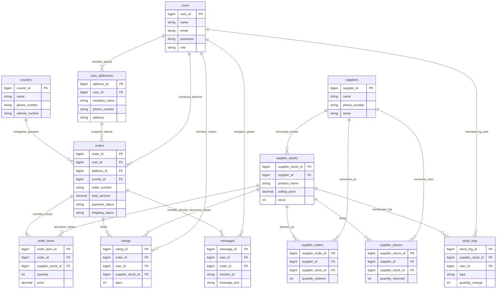

# DOKUMENTASI ERD (ENTITY RELATIONSHIP DIAGRAM) & TABEL RELASI
**SISTEM E-COMMERCE TOKO DEWI LESTARI 2**

Keterangan Simbol:
- `*` = Primary Key (PK)
- `**` = Foreign Key (FK)

---

## 1. VISUALISASI ERD (ENTITY RELATIONSHIP DIAGRAM)

---

## 2. TABEL RELASI (RELATIONAL SCHEMA MATRIX)

Tabel relasi di bawah ini memetakan seluruh keterhubungan antar-entitas, kolom Foreign Key (FK), tabel induk (*referenced table*), kardinalitas relasi, serta aturan integritas *Foreign Key Cascade*:

| No | Entitas Asal (Child Table) | Kolom Primary Key (PK) | Kolom Foreign Key (FK) | Entitas Induk (Parent Table) | Kolom Ref Induk | Kardinalitas | Aturan Integritas (Cascade Rule) | Keterangan Fungsi Relasi |
| :--- | :--- | :--- | :--- | :--- | :--- | :--- | :--- | :--- |
| 1 | **`user_addresses`** | `address_id*` | `user_id**` | `users` | `user_id*` | **1 : N** | `ON DELETE CASCADE` | 1 Pengguna dapat menyimpan banyak Alamat Pengiriman. |
| 2 | **`supplier_stocks`** | `supplier_stock_id*` | `supplier_id**` | `suppliers` | `supplier_id*` | **1 : N** | `ON DELETE CASCADE` | 1 Suplier menyuplai banyak Produk & Stok Varian Toko. |
| 3 | **`orders`** | `order_id*` | `user_id**` | `users` | `user_id*` | **1 : N** | `ON DELETE CASCADE` | 1 Pelanggan dapat membuat banyak Transaksi Pesanan. |
| 4 | **`orders`** | `order_id*` | `address_id**` | `user_addresses` | `address_id*` | **1 : N** (Snapshot) | `ON DELETE SET NULL` | Alamat tujuan pesanan yang disalin dari Profil Alamat. |
| 5 | **`orders`** | `order_id*` | `courier_id**` | `couriers` | `courier_id*` | **1 : N** | `ON DELETE SET NULL` | 1 Kurir Toko dapat ditugaskan mengantar banyak Pesanan. |
| 6 | **`order_items`** | `order_item_id*` | `order_id**` | `orders` | `order_id*` | **1 : N** | `ON DELETE CASCADE` | 1 Transaksi Pesanan memiliki banyak Rincian Item Barang. |
| 7 | **`order_items`** | `order_item_id*` | `supplier_stock_id**` | `supplier_stocks` | `supplier_stock_id*` | **1 : N** | `ON DELETE CASCADE` | 1 Jenis Produk dapat dibeli dalam banyak Rincian Pesanan. |
| 8 | **`supplier_orders`**| `supplier_order_id*` | `supplier_id**` | `suppliers` | `supplier_id*` | **1 : N** | `ON DELETE CASCADE` | 1 Suplier menerima banyak Surat Pemesanan Barang (PO). |
| 9 | **`supplier_orders`**| `supplier_order_id*` | `supplier_stock_id**` | `supplier_stocks` | `supplier_stock_id*` | **1 : N** | `ON DELETE SET NULL` | 1 Produk dapat dipesan ulang melalui banyak PO Suplier. |
| 10 | **`supplier_returns`**| `supplier_return_id*` | `supplier_id**` | `suppliers` | `supplier_id*` | **1 : N** | `ON DELETE CASCADE` | 1 Suplier menerima banyak Tiket Pengajuan Retur Cacat. |
| 11 | **`supplier_returns`**| `supplier_return_id*` | `supplier_stock_id**` | `supplier_stocks` | `supplier_stock_id*` | **1 : N** | `ON DELETE SET NULL` | 1 Produk Cacat terhubung ke Tiket Retur Suplier. |
| 12 | **`stock_logs`** | `stock_log_id*` | `supplier_stock_id**` | `supplier_stocks` | `supplier_stock_id*` | **1 : N** | `ON DELETE CASCADE` | 1 Produk memiliki banyak Catatan Log Audit Stok (FIFO). |
| 13 | **`stock_logs`** | `stock_log_id*` | `user_id**` | `users` | `user_id*` | **1 : N** | `ON DELETE SET NULL` | 1 Admin Toko menginput banyak Catatan Audit Stok. |
| 14 | **`ratings`** | `rating_id*` | `user_id**` | `users` | `user_id*` | **1 : N** | `ON DELETE CASCADE` | 1 Pelanggan dapat memberikan banyak Ulasan Rating Produk. |
| 15 | **`ratings`** | `rating_id*` | `supplier_stock_id**` | `supplier_stocks` | `supplier_stock_id*` | **1 : N** | `ON DELETE CASCADE` | 1 Produk menerima banyak Ulasan Bintang & Komentar. |
| 16 | **`ratings`** | `rating_id*` | `order_id**` | `orders` | `order_id*` | **1 : N** | `ON DELETE CASCADE` | 1 Pesanan Lunas yang telah selesai diberikan Rating. |
| 17 | **`messages`** | `message_id*` | `user_id**` | `users` | `user_id*` | **1 : N** | `ON DELETE SET NULL` | 1 Pengguna berinteraksi dalam banyak Pesan Live Chat. |
| 18 | **`messages`** | `message_id*` | `order_id**` | `orders` | `order_id*` | **1 : N** | `ON DELETE SET NULL` | 1 Pesanan terhubung ke Sesi Live Chat Customer Service. |

---

## 📐 3. RINGKASAN STRUKTUR TEKNIS SCHEMA RELASI:

1. **`users`** (`user_id*`, `name`, `email`, `password`, `google_id`, `avatar`, `role`, `phone`, `gender`)
2. **`user_addresses`** (`address_id*`, `user_id**`, `recipient_name`, `phone_number`, `address`, `city`, `province`, `postal_code`, `is_primary`)
3. **`suppliers`** (`supplier_id*`, `name`, `phone_number`, `email`, `address`)
4. **`supplier_stocks`** (`supplier_stock_id*`, `supplier_id**`, `product_name`, `category`, `variants`, `total_quantity`, `supplier_price`, `selling_price`, `entry_date`)
5. **`orders`** (`order_id*`, `user_id**`, `address_id**`, `courier_id**`, `order_number`, `tracking_ticket_id`, `customer_name`, `customer_phone`, `delivery_address`, `total_price`, `shipping_cost`, `payment_method`, `payment_status`, `tracking_status`, `transfer_proof`, `delivery_proof`, `payment_notes`)
6. **`order_items`** (`order_item_id*`, `order_id**`, `supplier_stock_id**`, `weight_variant`, `quantity`, `price`, `subtotal`)
7. **`couriers`** (`courier_id*`, `name`, `phone_number`, `vehicle_number`, `is_active`)
8. **`supplier_orders`** (`supplier_order_id*`, `supplier_id**`, `supplier_stock_id**`, `order_date`, `quantity_ordered`, `status`)
9. **`supplier_returns`** (`supplier_return_id*`, `supplier_id**`, `supplier_stock_id**`, `return_date`, `quantity_returned`, `reason`, `proof_image`, `status`)
10. **`stock_logs`** (`stock_log_id*`, `supplier_stock_id**`, `user_id**`, `type`, `quantity_change`, `description`)
11. **`ratings`** (`rating_id*`, `order_id**`, `user_id**`, `supplier_stock_id**`, `stars`, `comment`)
12. **`messages`** (`message_id*`, `user_id**`, `order_id**`, `session_id`, `sender_type`, `message_text`)
