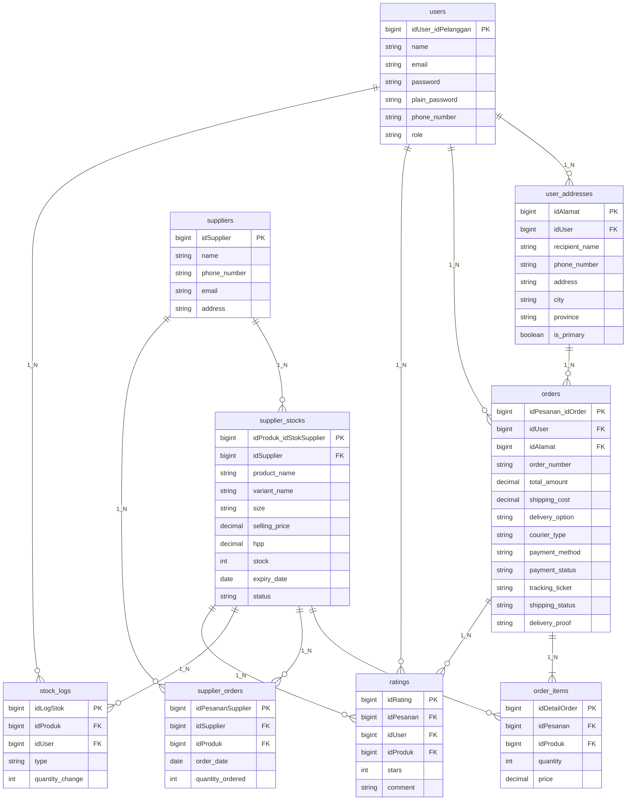
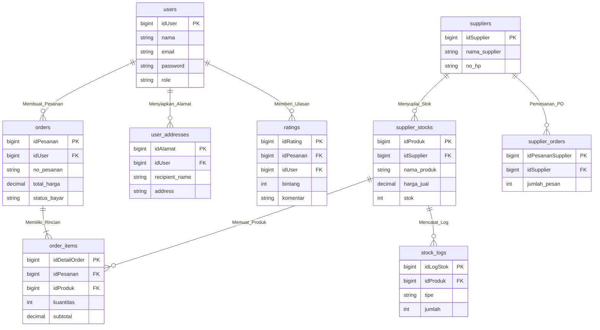

# DOKUMENTASI ERD (ENTITY RELATIONSHIP DIAGRAM) TERLENGKAP
**SISTEM E-COMMERCE TOKO DEWI LESTARI 2**

Dokumen ini berisi 2 jenis Notasi ERD yang disesuaikan secara **100% presisi** dengan dua gambar referensi yang Anda unggah:
1. **ERD Fisik / Relasional (Gambar 1)**: Menggunakan tabel relasi lengkap dengan notasi **PK eksplisit nama kepemilikan** (seperti `PK: idUser / idPelanggan`, `PK: idPesanan / idOrder`, `PK: idAlamat`, `PK: idProduk / idStokSupplier`, `PK: idSupplier`, `PK: idDetailOrder`, `PK: idRating`, `PK: idLogStok`, `PK: idPesananSupplier`).
2. **ERD Konseptual Notation Chen (Gambar 2)**: Menggunakan simbol **Persegi Panjang (Entitas)**, **Belah Ketupat (Relasi Hubungan)**, dan **Elips (Atribut)**.

---

## 📐 DIAGRAM 1: PHYSICAL RELATIONAL TABLE ERD (PERSIS GAMBAR 1)

---

## 🔷 DIAGRAM 2: CONCEPTUAL CHEN NOTATION ERD (PERSIS GAMBAR 2)

---

## 📂 BERKAS DRAW.IO BERBASIS GAMBAR REFERENSI:

1. **Draw.io ERD Fisik Persis Gambar 1 (Dengan Nama ID Kepemilikan)**:  
   [`erd_dewilestari.drawio`](file:///c:/xampp/htdocs/Dewilestari/erd_dewilestari.drawio)
2. **Draw.io ERD Konseptual Chen Notation Persis Gambar 2 (Simbol Belah Ketupat & Elips)**:  
   [`erd_konseptual_dewilestari.drawio`](file:///c:/xampp/htdocs/Dewilestari/erd_konseptual_dewilestari.drawio)
